# 🛍️ Telegram Shop Bot

A production-ready Telegram shop bot with advanced security features, transactional integrity, comprehensive admin
tools, real-time monitoring, and disaster recovery capabilities.

[](https://www.python.org/downloads/)
[](https://docs.aiogram.dev/)
[](https://www.postgresql.org/)
[](https://www.docker.com/)
[](LICENSE)

---

## 🔀 Looking for Physical Goods Shop?

**💾 This version is for DIGITAL GOODS** (accounts, keys, licenses, etc.)

**📦 Need to sell PHYSICAL GOODS instead?** (if you need functions such as inventory, shipping, delivery addresses, etc.)
👉 **Try this new version**: [Telegram Physical Goods Shop](https://github.com/interlumpen/Telegram-shop-Physical)

The physical goods version features a well-thought-out delivery processing system, full interaction with the bot's core
via the command line (CLI) without the need for a shell and advanced monitoring of all processes.

---

## 🎬 Demo

<div align="center">
  
  
</div>

## 📋 Table of Contents

- [Features](#-features)
- [Security](#-security)
- [Architecture](#-architecture)
- [Tech Stack](#-tech-stack)
- [Environment Variables](#-environment-variables)
- [Installation](#-installation)
- [Admin Panel & Metrics](#-admin-panel--metrics)
- [Usage](#-usage)
- [API Documentation](#-api-documentation)
- [Testing](#-testing)
- [Contributing](#-contributing)
- [License](#-license)

## ✨ Features

### Core Shop Functionality

- **Product Management**: Categories, items with stock tracking
- **Transactional Purchases**: ACID-compliant purchase process
- **Multiple Payment Methods**:
    - 💎 CryptoPay (TON, USDT, BTC, ETH)
    - ⭐ Telegram Stars
    - 💳 Telegram Payments (Fiat)
- **Shopping Cart**: Add multiple items, apply promo codes per item, atomic multi-item checkout with receipt
- **Promo Codes**: Percent/fixed/balance discount types, category/item binding, usage limits, expiration
- **Product Reviews**: 1–5 star ratings with optional text, one review per user per item
- **Referral System**: Configurable commission rates
- **Multi-language Support**: Spanish-first localization with Russian disabled by default

### Admin Features

- **Role-Based Access Control** (RBAC):
    - Built-in roles: USER, ADMIN, OWNER
    - 10 granular permission bits: USE, BROADCAST, SETTINGS, USERS, CATALOG, ADMINS, OWNER, STATS, BALANCE, PROMOS
    - Custom roles: Create roles with any combination of permissions via admin panel
    - Role management: Create, edit, delete roles; assign roles to users
    - Permission-safe: Bitwise subset validation — cannot create/assign roles exceeding own permissions
    - Permission-aware UI: Admin panel shows only buttons matching user's actual permissions
- **Comprehensive Admin Panel**:
    - Real-time statistics dashboard
    - User management with balance control
    - Role management: create custom roles, assign roles to users
    - Product and category management
    - Broadcast messaging system
    - Promo code management (create, toggle, delete, view usage stats)
    - CSV data export (users, purchases, payments, operations) with date filtering
    - Dual-write audit logging (rotating file + database table with web UI)

### User Experience

- **Shopping Cart**: Add items, apply promo codes, batch checkout with formatted receipt
- **Purchase Receipts**: Formatted order receipt with item details, order ID, timestamp, and quick-view buttons
- **Product Reviews**: Rate and review purchased items (1–5 stars with optional text)
- **Lazy Loading Pagination**: Efficient data loading for large catalogs
- **Purchase History**: Complete transaction records
- **Referral Dashboard**: Track earnings and referrals
- **Channel Integration**: Optional news channel with subscription checks

### Performance & Reliability

- **Fully Async Database Layer**: Native async PostgreSQL via `asyncpg` + async SQLAlchemy
    - Zero thread-pool overhead — all DB operations run natively on the event loop
    - Async connection pooling with automatic recycling and timeout handling
    - Graceful handling of high-load scenarios
- **Optional Redis Caching**: Multi-layer caching system for optimal performance (disabled by default, enable with `REDIS_ENABLED=1`)
    - User role caching (15-minute TTL)
    - Product catalog caching (5-minute TTL)
    - Statistics caching (1-minute TTL)
    - Smart cache invalidation on data updates (purchases, admin item adds, stock changes)
    - Cache warm-up on startup (categories, user/admin counts)
    - Cache scheduler: hourly stats refresh, daily cleanup at 3:00 AM
    - When disabled: bot uses in-memory FSM storage and queries the database directly
- **Performance Optimizations**: Up to 60% reduction in database queries for read operations (with Redis enabled)
- **Optimized Queries**: JOIN-based queries instead of N+1 patterns, SQL-level sorting for paginated results

### Web Admin Panel & Monitoring

- **SQLAdmin Web Interface**:
    - Full database admin panel with authentication
    - Browse, search, filter, and edit all tables
    - Read-only views for purchases, payments, operations, and audit logs
    - All CRUD operations via web panel are audit-logged automatically
    - CSV data export endpoints (`/export/users`, `/export/purchases`, `/export/operations`, `/export/payments`) with
      optional date filtering
- **Real-Time Metrics Collection**:
    - Event tracking (purchases, payments, user actions)
    - Performance metrics (response times, query durations)
    - Error tracking and categorization
    - Conversion funnel analysis
- **Prometheus-Compatible Metrics**:
    - Export endpoint at `/metrics/prometheus`
    - Ready for integration with Grafana
    - Custom metrics for business KPIs
- **Health Check Endpoint**:
    - System status at `/health`
    - Database connectivity check
    - Redis status monitoring

### Disaster Recovery System

- **Payment Recovery**:
    - Automatic check for stuck CryptoPay payments (every 5 minutes)
    - Verifies payment status via CryptoPay API
    - Deadlock-safe: collects payment data, closes DB session, then processes asynchronously
    - Idempotent payment processing
    - User notification on recovery
- **Health Monitoring**:
    - Periodic system health checks (database, Redis, Telegram API)
    - Logs failures for observability
- **Data Cleanup**:
    - Scheduled daily cleanup at 4:00 UTC
    - Automatic deletion of old audit logs (configurable retention period)
    - Automatic deletion of old pending/failed payments
- **Graceful Shutdown**:
    - Metrics snapshot saved to `data/final_metrics.json`
    - Recovery tasks properly cancelled

## 🔒 Security

### Implemented Security Measures

#### 1. **Rate Limiting**

- Global limits: 30 requests per 60 seconds
- Action-specific limits:
    - Purchases: 5 per minute
    - Payments: 10 per minute
- Automatic ban system with configurable duration
- Admin bypass option
- Admin panel login rate limiting (5 attempts, 15-minute lockout per IP, periodic stale entry cleanup)
- Admin panel session timeout (30-minute max age)
- Default credentials protection: remote login blocked when using default `admin`/`admin`

#### 2. **Security Middleware**

- **SQL Injection Protection**: Parameterized queries via SQLAlchemy ORM (no raw SQL)
- **XSS Prevention**: HTML sanitization for broadcast messages and category names
- **Purchase Intent Verification**: Item name stored in server-side FSM state, verified on buy
- **Replay Attack Prevention**: Timestamp validation on transactional callbacks (buy, pay, balance operations)

#### 3. **Authentication & Authorization**

- Bot detection and blocking
- Telegram ID-based authentication
- Permission bitmask access control with 10 granular bits and bitwise subset validation
- Role caching with TTL for performance

#### 4. **Payment Security**

- **Pre-Checkout Validation**: Server-side amount validation against allowed range before accepting payment
- **Idempotent Payment Processing**: Prevents duplicate charges
- **Concurrent Payment Protection**: Graceful handling of duplicate payment attempts via IntegrityError catch
- **Transactional Integrity**: ACID compliance for all financial operations
- **Atomic Admin Balance Operations**: Top-up and deduction with FOR UPDATE lock in a single transaction
- **Self-Referral Prevention**: Database CHECK constraints on both `users` and `referral_earnings` tables, plus
  transaction-level guard against self-referral bonus abuse
- **Circuit Breaker for CryptoPay API**: Stops calling after 5 consecutive failures, auto-recovers after 60 seconds
- **External ID Tracking**: Unique identifiers for payment reconciliation
- **Error Sanitization**: Internal error details never exposed to users; generic error codes returned, details logged to
  audit

#### 5. **Data Validation**

- Pydantic models for request validation
- Decimal precision for monetary calculations
- HTML sanitization for user-facing text (broadcast, categories)
- Control character filtering for item names

## 🏗️ Architecture

### System Architecture

<details>
<summary>System Architecture Schema (click to expand)</summary>

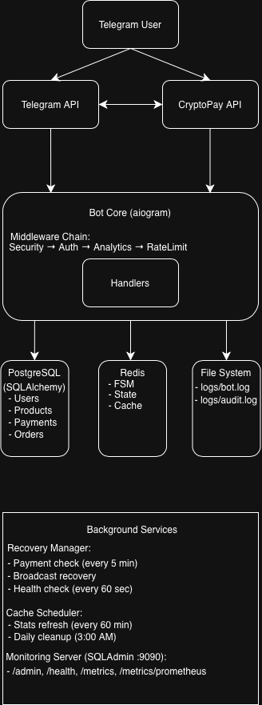
</details>

### Database Schema

<details>
<summary>Database Schema (click to expand)</summary>

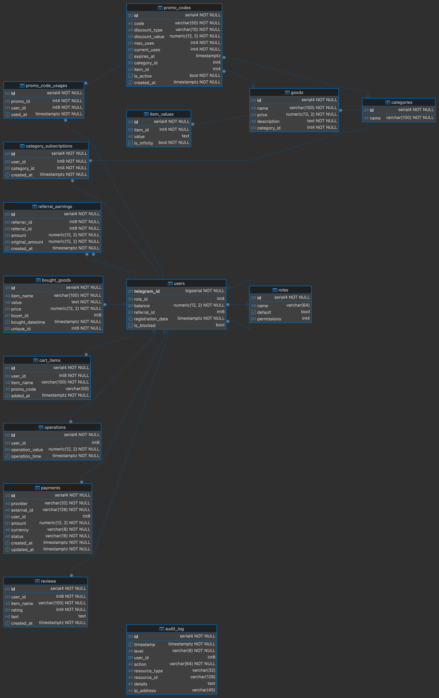
</details>

- **Users**: Telegram ID, balance, referral tracking
- **Roles**: Permission-based access control
- **Products**: Categories, items, stock management
- **Transactions**: Purchases, payments, operations
- **Referrals**: Earnings tracking and statistics
- **Promo Codes**: Discount codes with type, value, usage tracking, and category/item binding
- **Cart**: User shopping cart items with promo code association
- **Reviews**: Product ratings and text reviews (one per user per item)
- **Audit Log**: Structured action log with user, action, resource, details, and IP tracking

### Key Design Patterns

- **Singleton**: Database connection management
- **Repository Pattern**: Data access layer
- **Middleware Pipeline**: Request processing chain
- **State Pattern**: FSM for multi-step processes
- **Transaction Script**: Business logic encapsulation
- **Middleware Pattern**: Metrics collection and event tracking via AnalyticsMiddleware
- **Conversion Funnel**: Purchase funnel tracking (view_shop → view_item → purchase)
- **Natively Async DB**: All database operations use async SQLAlchemy with `asyncpg`, no thread-pool bridges

### Performance Architecture

- **Async Connection Pooling**: Native async PostgreSQL connection management with automatic recycling
- **Multi-Level Caching**: Optional Redis-based intelligent caching with TTL-based expiration
- **Cache Invalidation**: Smart cache clearing on data modifications
- **Concurrent Load Handling**: Optimized for high-traffic scenarios with connection queuing
- **Metrics Pipeline**: Asynchronous metrics collection without performance impact

## 💻 Tech Stack

### Core

- **Language**: Python 3.11+
- **Framework**: Aiogram 3.22+ (async Telegram Bot API)
- **Database**: PostgreSQL 16+ with async SQLAlchemy 2.0 (`asyncpg` driver)
- **Cache/Storage**: Redis 7+ (optional — FSM states, intelligent data caching)
- **Migrations**: Alembic

### Security & Validation

- **Input Validation**: Pydantic
- **Rate Limiting**: Custom in-memory middleware (per-process)
- **Authentication**: Role-based with 10-bit permission bitmask

### Payment Integrations

- **CryptoPay API**: Cryptocurrency payments (with circuit breaker)
- **Telegram Stars API**: Native digital currency
- **Telegram Payments API**: Traditional payment providers

### Web Admin & Monitoring

- **Admin Panel**: SQLAdmin with Starlette
- **Metrics Collection**: Custom MetricsCollector with event tracking
- **Export Formats**: JSON, Prometheus metrics format

### DevOps

- **Containerization**: Docker & Docker Compose
- **Logging**: Rotating file handlers + structured database audit log (`audit_log` table)
- **Testing**: Pytest with `pytest-asyncio` (async SQLite via `aiosqlite`)
- **CI/CD Ready**: Environment-based configuration
- **Health Checks**: Built-in health monitoring endpoints

## ⚙️ Environment Variables

The application requires the following environment variables:

<details>
<summary><b>🤖 Telegram</b></summary>

| Variable   | Description                                                | Required |
|------------|------------------------------------------------------------|----------|
| `TOKEN`    | [Bot Token from @BotFather](https://telegram.me/BotFather) | ✅        |
| `OWNER_ID` | [Your Telegram ID](https://telegram.me/myidbot)            | ✅        |

</details>

<details>
<summary><b>💳 Payments</b></summary>

| Variable                  | Description                                                                                  | Default |
|---------------------------|----------------------------------------------------------------------------------------------|---------|
| `TELEGRAM_PROVIDER_TOKEN` | [Token for Telegram Payments](https://core.telegram.org/bots/payments#getting-a-token)       | -       |
| `CRYPTO_PAY_TOKEN`        | [CryptoPay API token](https://help.send.tg/en/articles/10279948-crypto-pay-api#h_020215e6d7) | -       |
| `STARS_PER_VALUE`         | Stars exchange rate (0 to disable)                                                           | `0.91`  |
| `PAY_CURRENCY`            | Display currency (RUB, USD, EUR, etc.)                                                       | `RUB`   |
| `REFERRAL_PERCENT`        | Referral commission percentage                                                               | `0`     |
| `PAYMENT_TIME`            | Invoice validity in seconds                                                                  | `1800`  |
| `MIN_AMOUNT`              | Minimum payment amount                                                                       | `20`    |
| `MAX_AMOUNT`              | Maximum payment amount                                                                       | `10000` |

</details>

<details>
<summary><b>🔗 Links / UI</b></summary>

| Variable      | Description                                                                             | Default |
|---------------|-----------------------------------------------------------------------------------------|---------|
| `CHANNEL_URL` | News channel link (the bot sends notifications about new products here when setting up) | -       |
| `CHANNEL_ID`  | [News channel ID](https://telegram.me/get_id_bot)                                       | -       |
| `HELPER_ID`   | Support user Telegram ID                                                                | -       |
| `RULES`       | Bot usage rules text                                                                    | -       |

</details>

<details>
<summary><b>🌐 Locale & Logs</b></summary>

| Variable          | Description                        | Default     |
|-------------------|------------------------------------|-------------|
| `BOT_LOCALE`      | Localization language (ru/en)      | `ru`        |
| `BOT_LOGFILE`     | Path to main log file              | `bot.log`   |
| `BOT_AUDITFILE`   | Path to audit log file             | `audit.log` |
| `LOG_TO_STDOUT`   | Console logging (1/0)              | `1`         |
| `LOG_TO_FILE`     | File logging (1/0)                 | `1`         |
| `DEBUG`           | Debug mode (1/0)                   | `0`         |
| `REVIEWS_ENABLED` | Enable product review system (1/0) | `1`         |

</details>

<details>
<summary><b>📊 Web Admin Panel</b></summary>

| Variable         | Description                       | Default                   |
|------------------|-----------------------------------|---------------------------|
| `ADMIN_HOST`     | Admin panel bind address          | `localhost`               |
| `ADMIN_PORT`     | Admin panel port                  | `9090`                    |
| `ADMIN_USERNAME` | Admin panel login                 | `admin`                   |
| `ADMIN_PASSWORD` | Admin panel password              | `admin`                   |
| `SECRET_KEY`     | Secret key for session encryption | `change-me-in-production` |

**Note**: In Docker, `ADMIN_HOST` is automatically set to `0.0.0.0` and the admin panel is bound to `127.0.0.1:9090` (
localhost only). Change `ADMIN_USERNAME`, `ADMIN_PASSWORD`, and `SECRET_KEY` in production. Remote login with default
credentials (`admin`/`admin`) is automatically blocked.

</details>

<details>
<summary><b>📦 Redis Storage (Optional)</b></summary>

| Variable         | Description                                                    | Default     |
|------------------|----------------------------------------------------------------|-------------|
| `REDIS_ENABLED`  | Enable Redis for caching and FSM storage (`1` = on, `0` = off) | `1`         |
| `REDIS_HOST`     | Redis server address                                           | `localhost` |
| `REDIS_PORT`     | Redis server port                                              | `6379`      |
| `REDIS_DB`       | Redis database number                                          | `0`         |
| `REDIS_PASSWORD` | Redis password (leave empty for Docker)                        | -           |

**Note**: When `REDIS_ENABLED=0`, the bot uses in-memory storage for FSM states (lost on restart) and all caching is
disabled. The bot remains fully functional but without caching optimizations.

</details>

<details>
<summary><b>🗄️ Database</b></summary>

| Variable            | Description                                             | Default                                  |
|---------------------|---------------------------------------------------------|------------------------------------------|
| `POSTGRES_DB`       | PostgreSQL database name                                | **Required**                             |
| `POSTGRES_USER`     | PostgreSQL username                                     | **Required**                             |
| `POSTGRES_PASSWORD` | PostgreSQL password                                     | **Required**                             |
| `POSTGRES_HOST`     | PostgreSQL host (configure this only for manual deploy) | localhost (for manual) / db (for docker) |
| `DB_PORT`           | PostgreSQL port                                         | `5432`                                   |

</details>

<details>
<summary><b>🌐 Webhook Mode (Optional)</b></summary>

| Variable          | Description                                             | Default    |
|-------------------|---------------------------------------------------------|------------|
| `WEBHOOK_ENABLED` | Use webhook instead of polling (`1`/`0`)                | `0`        |
| `WEBHOOK_URL`     | Public URL for webhook (e.g., `https://yourdomain.com`) | -          |
| `WEBHOOK_PATH`    | Path for webhook endpoint                               | `/webhook` |
| `WEBHOOK_SECRET`  | Secret token for webhook verification                   | -          |

**Note**: Webhook mode requires a publicly accessible HTTPS URL. When disabled (default), the bot uses long polling.

</details>

<details>
<summary><b>🧹 Auto-Cleanup</b></summary>

| Variable                  | Description                                         | Default |
|---------------------------|-----------------------------------------------------|---------|
| `AUDIT_RETENTION_DAYS`    | Days to keep audit log entries (0 to disable)       | `90`    |
| `PAYMENTS_RETENTION_DAYS` | Days to keep pending/failed payments (0 to disable) | `90`    |

</details>

## 📦 Installation

### Prerequisites

- Docker and Docker Compose (recommended)
- OR Python 3.11+ and PostgreSQL 16+
- Redis 7+ (optional — for caching and persistent FSM storage)

### 🐳 Deploy with Docker (Recommended)

1. **Clone the repository**

```bash
git clone https://github.com/interlumpen/Telegram-shop.git
cd Telegram-shop
```

2. **Create environment file**

```bash
cp .env.example .env
# Edit .env with your configuration
```

3. **Start the bot**

```bash
# With Redis (caching enabled):
docker compose --profile redis up -d --build

# Without Redis (simpler setup, no caching):
# Set REDIS_ENABLED=0 in .env first
docker compose up -d --build
```

**Linux Users**: If you encounter permission errors for `./logs` or `./data` directories, set `PUID` and `PGID` in your
`.env` file to match your host user:

```bash
# Find your UID/GID
id
# Output: uid=1000(username) gid=1000(username) ...

# Add to .env file
echo "PUID=1000" >> .env
echo "PGID=1000" >> .env
```

The bot will automatically:

- Create database schema
- Apply all migrations
- Initialize roles and permissions
- Start accepting messages
- Launch admin panel at http://localhost:9090/admin (localhost only)
- Initialize recovery systems
- Enable Docker health check via `/health` endpoint

4. **View logs** (optional)

```bash
docker compose logs -f bot
```

5. **Access admin panel**

Open in browser: http://localhost:9090/admin

> **Important**: Default credentials are `admin`/`admin`. Remote login with default credentials is blocked — change
`ADMIN_USERNAME`, `ADMIN_PASSWORD`, and `SECRET_KEY` in `.env` before exposing the admin panel.

### 🔧 Manual Deployment

1. **Clone the repository**

```bash
git clone https://github.com/interlumpen/Telegram-shop.git
cd Telegram-shop
```

2. **Create virtual environment**

```bash
python3.11 -m venv venv
source venv/bin/activate  # On Windows: venv\Scripts\activate
```

3. **Install dependencies**

```bash
pip install --upgrade pip
pip install -r requirements.txt
```

4. **Set up PostgreSQL**

```bash
# Create database (adjust credentials as needed)
createdb telegram_shop
createuser shop_user -P
```

5. **Create environment file**

```bash
cp .env.example .env
# Edit .env with your configuration
```

6. **Run migrations**

```bash
alembic upgrade head
```

7. **Start the bot**

```bash
python run.py
```

8. **Access admin panel** (optional)

Open in browser: http://localhost:9090/admin

### 📝 Post-Installation

1. **Add bot to channel** (if using news channel feature):
    - Add your bot to the channel specified in `CHANNEL_URL` and `CHANNEL_ID`
    - Grant administrator rights with "Post Messages" permission

The bot will send relevant messages to your channel when adding products.

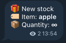

2. **Apply latest migrations** (if updating):

```bash
# With Docker
docker compose run --rm bot alembic upgrade head

# Manual deployment
alembic upgrade head
```

3. **Verify installation**:
    - Send `/start` to your bot
    - Check that main menu appears
    - Access admin panel (owner only initially)
    - Check admin panel at http://localhost:9090/admin

## 📊 Admin Panel & Metrics

### Web Admin Panel

The bot includes a web-based admin panel powered by SQLAdmin, accessible at http://localhost:9090/admin

- Login with credentials from your `.env` file (`ADMIN_USERNAME` / `ADMIN_PASSWORD`)
- Browse all database tables: users, roles, categories, products, purchases, payments, operations, referral earnings,
  audit logs
- Search, filter, and sort records
- Read-only access for financial tables (purchases, payments, operations) and audit logs
- All create/edit/delete operations through the web panel are automatically audit-logged

#### Monitoring Endpoints

- /health - Health check endpoint (database, Redis status if enabled)
- /metrics - Raw metrics in JSON format
- /metrics/prometheus - Prometheus-compatible metrics export
- /export/users - CSV export of users (with optional date filtering)
- /export/purchases - CSV export of purchases
- /export/operations - CSV export of operations
- /export/payments - CSV export of payments

### Recovery System

The bot includes a recovery system for stuck payments:

#### Payment Recovery

- Checks for stuck CryptoPay payments every 5 minutes
- Verifies payment status via CryptoPay API
- Automatically credits confirmed but uncredited payments
- Notifies users when recovery succeeds

#### Health Monitoring

- Periodic checks of database, Redis (when enabled), and Telegram API (every 60 seconds)
- Logs failures for observability

## 📱 Usage

### User Interface

<details>
<summary>👤 User Features (click to expand)</summary>

#### Main Navigation

- `/start` - Initialize bot and show main menu
- Shop navigation via inline keyboard
- Quick access to all features

#### Main Menu

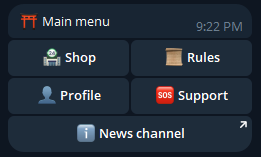

#### Shop Categories

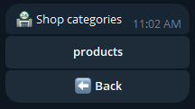

#### Shop Goods

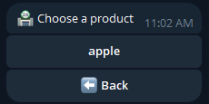

#### Shop Item Information & Purchase


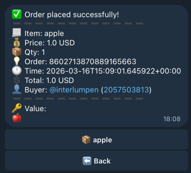

#### Profile

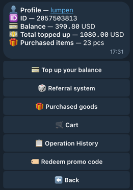

#### Balance top up

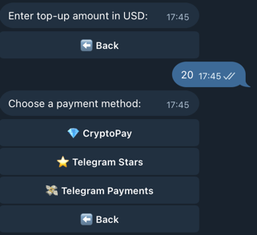

#### Referral System

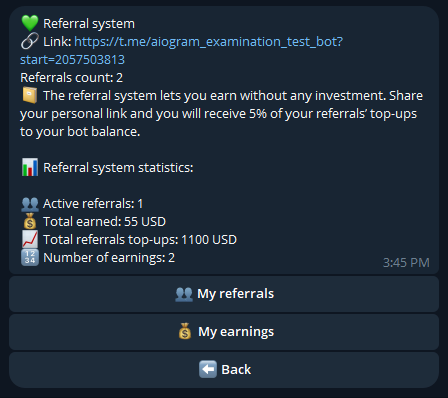

#### Purchases


### Cart

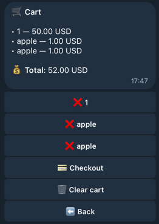

## Operation History

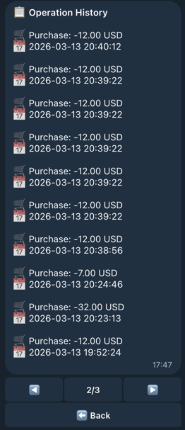

</details>

### Admin Panel

<details>
<summary>🎛️ Admin Features (click to expand)</summary>

Available for users with admin permissions (built-in ADMIN/OWNER or custom roles):

#### Admin Panel


#### Shop Management


#### Categories & Items Management

- Categories, products, stock control

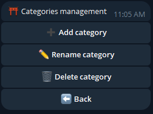

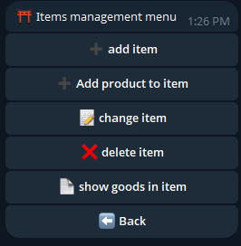

#### User Management

- View profiles, block/unblock users, assign roles (USERS permission)
- Adjust balances: top-up and deduction (separate BALANCE permission)


#### Role Management

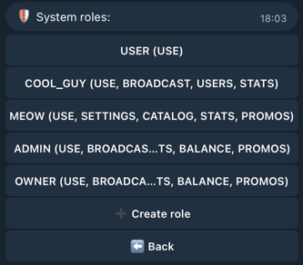

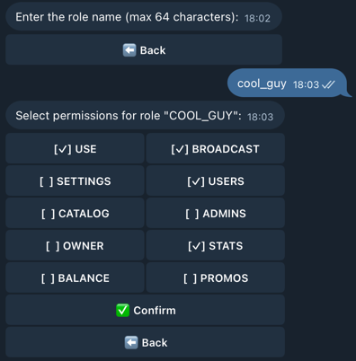

- 10 granular permission bits for fine-grained access control:
    - **USE** (1) — basic bot access
    - **BROADCAST** (2) — mass messaging to all users
    - **SETTINGS** (4) — bot settings (maintenance mode)
    - **USERS** (8) — view/block/unblock users, view referrals and purchases
    - **CATALOG** (16) — categories, positions, items/goods CRUD
    - **ADMINS** (32) — role CRUD and role assignment
    - **OWNER** (64) — owner-only operations
    - **STATS** (128) — statistics dashboard, log files, bought-item search
    - **BALANCE** (256) — top-up / deduct user balance
    - **PROMOS** (512) — promo code management (create, toggle, delete)
- Create custom roles with any combination of permissions via admin panel
- Edit and delete custom roles (built-in USER/ADMIN/OWNER cannot be deleted)
- Permission-aware admin panel: each user sees only the buttons their permissions allow
- Permission-safe: bitwise subset validation prevents creating or assigning roles exceeding your own

#### Broadcasting & Analytics

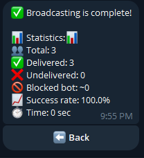

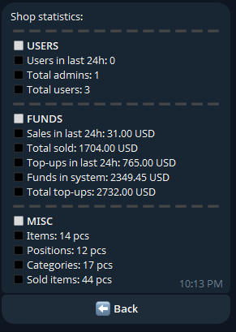

#### System Monitoring


</details>

## 📊 API Documentation

### Core Database Methods

#### User Management

```python
await create_user(telegram_id: int, registration_date: datetime, referral_id: int, role: int) -> None
await check_user(telegram_id: int) -> Optional[User]
await update_balance(telegram_id: int, amount: int) -> None
```

#### Transaction Processing

```python
await buy_item_transaction(telegram_id: int, item_name: str, promo_code: str = None) -> tuple[bool, str, dict]
await checkout_cart_transaction(user_id: int) -> tuple[bool, str, list]
await process_payment_with_referral(
    user_id: int, amount: Decimal, provider: str, external_id: str, referral_percent: int = 0) -> tuple[bool, str]
await admin_balance_change(telegram_id: int, amount: int) -> tuple[bool, str]
await redeem_balance_promo(code: str, user_id: int) -> tuple[bool, str, Decimal | None]
```

#### Product Management

```python
await create_item(item_name: str, item_description: str, item_price: int, category_name: str) -> None
await add_values_to_item(item_name: str, value: str, is_infinity: bool) -> bool
await delete_item(item_name: str) -> None
```

#### Role Management

```python
await create_role(name: str, permissions: int) -> int | None
await update_role(role_id: int, name: str, permissions: int) -> tuple[bool, str | None]
await delete_role(role_id: int) -> tuple[bool, str | None]
await get_all_roles() -> list[dict]
await get_roles_with_max_perms(max_perms: int) -> list[dict]
await get_role_by_id(role_id: int) -> dict | None
await count_users_with_role(role_id: int) -> int
```

### Middleware Configuration

```python
# Rate limiting
RateLimitConfig(
    global_limit=30,
    global_window=60,
    action_limits={'buy_item': (5, 60)},
    ban_duration=300
)

# Security layers
SecurityMiddleware()
AuthenticationMiddleware()
```

### Metrics Collection

```python
# Track custom events
metrics.track_event("purchase", user_id, metadata={"item": item_name})
metrics.track_timing("database_query", duration_ms)
metrics.track_conversion("purchase_funnel", "view_item", user_id)

# Get metrics summary
summary = metrics.get_metrics_summary()
prometheus_format = metrics.export_to_prometheus()
```

### Recovery Management

```python
# Initialize recovery manager
recovery_manager = RecoveryManager(bot)
await recovery_manager.start()

# Manual recovery trigger
await recovery_manager.recover_pending_payments()
```

### Audit Logging

```python
from bot.database.methods.audit import log_audit

# Dual-write: logs to both rotating file and audit_log DB table
await log_audit(
    "purchase",  # action name
    level="INFO",  # INFO / WARNING / ERROR
    user_id=123456789,  # who performed the action
    resource_type="Item",  # affected entity type
    resource_id="Premium Account",  # affected entity ID
    details="price=100 RUB",  # free-form context
    ip_address=None,  # for web admin actions
)
```

### Caching & Performance

```python
# Cache configuration examples
@cache_result(ttl=900, key_prefix="user_roles")  # 15 minutes
async def get_user_role(telegram_id: int) -> str


@cache_result(ttl=300, key_prefix="catalog")  # 5 minutes  
async def get_products_by_category(category_id: int) -> List[Product]


# Cache invalidation (called automatically after purchases, admin item adds, and stock changes)
await invalidate_user_cache(telegram_id)
await invalidate_item_cache(item_name, category_name)  # category_name is optional
```

### Async Engine Configuration

```python
from sqlalchemy.ext.asyncio import create_async_engine

engine = create_async_engine(
    DATABASE_URL,  # postgresql+asyncpg://...
    pool_size=20,  # Base pool size
    max_overflow=40,  # Additional connections during peaks
    pool_recycle=3600,  # Refresh connections every hour
    pool_timeout=30,  # Max wait time for connection
    connect_args={
        "timeout": 10,
        "command_timeout": 30,
    },
)
```

## 🧪 Testing

The project includes a comprehensive test suite with **448 tests** covering all major components, business logic, and
edge cases. Tests use SQLite in-memory with real SQL queries, and a dict-based FakeCacheManager for realistic cache
behavior. Coverage is measured automatically on every run via `pytest-cov`.

### Running Tests

```bash
# Run all tests with verbose output (coverage report included by default)
pytest tests/ -v

# Run specific test modules
pytest tests/test_transactions.py -v
pytest tests/test_filters.py -v
pytest tests/test_payment_service.py -v

# Run with HTML coverage report
pytest tests/ --cov-report=html
```

### Test Modules Overview

| Module                       | Tests   | Coverage                                                          |
|------------------------------|---------|-------------------------------------------------------------------|
| `test_database_crud.py`      | 71      | CRUD: users, roles, categories, items, balance, stats             |
| `test_role_management.py`    | 53      | Role CRUD, handlers, helpers, Permission bitwise, regressions     |
| `test_validators.py`         | 44      | Input validation, control chars, XSS, Pydantic models             |
| `test_middleware.py`         | 45      | Rate limiting, suspicious patterns, critical/replay actions, auth |
| `test_keyboards.py`          | 31      | All inline keyboard generators incl. admin console                |
| `test_admin_handlers.py`     | 27      | User management, assign role, balance edge cases, categories      |
| `test_transactions.py`       | 21      | Purchase & payment transactions, idempotency, admin balance       |
| `test_other_handlers.py`     | 16      | check_sub_channel, payment methods, hash, item name safety        |
| `test_filters.py`            | 15      | ValidAmountFilter, HasPermissionFilter (boundaries, permissions)  |
| `test_payment_service.py`    | 14      | currency_to_stars, minor units, Stars/Fiat invoices, CryptoPayAPI |
| `test_metrics.py`            | 14      | MetricsCollector, AnalyticsMiddleware                             |
| `test_cache_invalidation.py` | 13      | Cache invalidation after DB mutations                             |
| `test_broadcast.py`          | 11      | BroadcastManager, BroadcastStats                                  |
| `test_payment_handlers.py`   | 10      | Balance top-up, payment check, item purchase                      |
| `test_shop_handlers.py`      | 10      | Shop browsing, item info, bought items                            |
| `test_paginator.py`          | 10      | LazyPaginator with caching                                        |
| `test_user_handlers.py`      | 8       | /start, profile, rules, referral registration                     |
| `test_i18n.py`               | 8       | get_locale, localize: fallback, formatting, error handling        |
| `test_referral_system.py`    | 7       | Referral stats, earnings, view referrals                          |
| `test_recovery.py`           | 7       | RecoveryManager lifecycle, payment recovery, timeout, skip        |
| `test_login_rate_limiter.py` | 6       | LoginRateLimiter: blocking, reset, expiry, IP isolation           |
| `test_audit.py`              | 4       | log_audit: DB record creation, levels, optional fields            |
| **Total**                    | **448** | **Complete system coverage**                                      |

### Test Architecture

- **`conftest.py`** — shared fixtures: async SQLite in-memory DB via `aiosqlite` (StaticPool), FakeCacheManager (dict +
  fnmatch), FakeFSMContext, factory fixtures (user, category, item), mock builders (CallbackQuery, Message)
- **Mocks only for external services**: Telegram Bot API, CryptoPay API
- **Real async SQL queries** via async SQLAlchemy against SQLite — no mocked DB sessions

The test suite validates:

<details>
<summary>Core Functionality</summary>

* ✅ **Transactional purchase safety** — balance deduction, stock removal, rollback on error
* ✅ **Cart checkout integrity** — atomic multi-item checkout, duplicate value prevention for same-item cart entries
* ✅ **Payment idempotency** — duplicate payment processing prevented via unique constraint
* ✅ **Referral bonus calculation** — percentage-based bonus, referrer cache invalidation
* ✅ **Atomic admin balance operations** — top-up, deduction, insufficient funds check in single transaction
* ✅ **Cache invalidation after mutations** — stale balance/stats/item count prevention (purchases, admin adds)

</details>

<details>
<summary>Security & Middleware</summary>

* ✅ **Rate limiting** — global limits, action-specific limits, ban after exceed, ban expiry
* ✅ **Suspicious pattern detection** — XSS/script injection, length-based DoS protection
* ✅ **Critical action detection** — audit logging for buy/pay/delete/admin operations, replay protection for
  transactional actions
* ✅ **Authentication middleware** — blocked user rejection, bot rejection
* ✅ **Permission bitmask helpers** — `is_subset`, `has_any_admin_perm` bitwise validation
* ✅ **Admin panel login rate limiting** — block after max attempts, lockout expiry, IP isolation

</details>

<details>
<summary>Database Operations</summary>

* ✅ **Full CRUD** — users, roles (incl. custom role create/update/delete), categories, items, item values, payments,
  operations, referral earnings
* ✅ **Balance operations** — positive/negative updates, insufficient funds check
* ✅ **Duplicate handling** — duplicate users ignored, duplicate categories/items rejected
* ✅ **Blocking** — set_user_blocked, is_user_blocked
* ✅ **Stats queries** — today/all orders, operations, user balance aggregation

</details>

<details>
<summary>Handler Testing</summary>

* ✅ **User handlers** — /start (new user, referral, self-referral, owner role, non-private chat), profile, rules
* ✅ **Payment handlers** — replenish balance flow, CryptoPay paid/active/expired, duplicate prevention, item purchase
* ✅ **Shop handlers** — category browsing, item list, item info (limited/unlimited), bought items
* ✅ **Admin handlers** — check user, assign role, replenish/deduct balance, block/unblock, category CRUD, item
  delete
* ✅ **Role management** — create/edit/delete roles, permission toggles, assign role to users, bitwise escalation
  prevention, permission-aware admin keyboard
* ✅ **Referral handlers** — referral page, view referrals list, earnings, earning detail

</details>

<details>
<summary>Data Validation</summary>

* ✅ **Telegram ID validation** — valid, zero, negative, too large, string conversion, None
* ✅ **Money amount validation** — min/max bounds, decimal, non-numeric, negative
* ✅ **HTML sanitization** — escapes dangerous tags, preserves safe formatting (bold, italic, code)
* ✅ **Pydantic models** — PaymentRequest, ItemPurchaseRequest, CategoryRequest, BroadcastMessage

</details>

<details>
<summary>Infrastructure</summary>

* ✅ **Broadcast system** — all success, partial failure, forbidden user, cancel mid-batch, progress callback
* ✅ **Recovery manager** — paid/expired/active payment recovery, API timeout handling, provider filtering, start/stop
  lifecycle
* ✅ **Metrics** — event/timing/error tracking, conversion funnels, Prometheus export
* ✅ **Pagination** — page loading, caching, cache eviction, state serialization, empty results
* ✅ **Keyboards** — main menu, profile, payment, item info, referral, admin buttons
* ✅ **Filters** — ValidAmountFilter (boundaries, non-digit, empty), HasPermissionFilter (bitmask, no role)
* ✅ **Payment service** — currency_to_stars rounding, minor units (JPY/KRW), invoice generation, CryptoPayAPI errors
* ✅ **i18n** — locale detection, fallback to default, key formatting, missing key passthrough
* ✅ **Utility handlers** — channel subscription check, payment method detection, hash generation, item name safety
* ✅ **Audit logging** — dual-write to file and DB, all log levels, optional fields

</details>

### Test Quality Features

- **Real async DB queries**: Async SQLite in-memory via `aiosqlite` with StaticPool — tests catch real SQL issues
- **Realistic cache**: FakeCacheManager with pattern-based invalidation (fnmatch)
- **Async testing**: Full asyncio support with `pytest-asyncio` (auto mode — no manual `@pytest.mark.asyncio` needed)
- **Per-test isolation**: Automatic data cleanup between tests (FK-ordered delete)
- **Factory pattern**: Reusable `user_factory`, `category_factory`, `item_factory` fixtures
- **Security Validation**: XSS detection, critical action audit, and input sanitization testing
- **Automatic Coverage**: `pytest-cov` runs on every test invocation (`--cov=bot --cov-report=term-missing`)
- **Pytest Markers**: `unit`, `integration`, `slow` for selective test runs

## 🤝 Contributing

1. Fork the repository
2. Create a feature branch (`git checkout -b feature/amazing-feature`)
3. Commit your changes (`git commit -m 'Add amazing feature'`)
4. Push to the branch (`git push origin feature/amazing-feature`)
5. Open a Pull Request

### Development Guidelines

- Follow PEP 8 style guide
- Add tests for new features
- Update documentation
- Use type hints
- Write meaningful commit messages

## 📄 License

This project is licensed under the MIT License - see the [LICENSE](LICENSE) file for details.

## 🙏 Acknowledgments

- [Aiogram](https://github.com/aiogram/aiogram) - Telegram Bot framework
- [SQLAlchemy](https://www.sqlalchemy.org/) - Database ORM
- [Redis](https://redis.io/) - Cache and storage
- Contributors and testers

## 📞 Support

- Create an [Issue](https://github.com/interlumpen/Telegram-shop/issues) for bug reports
